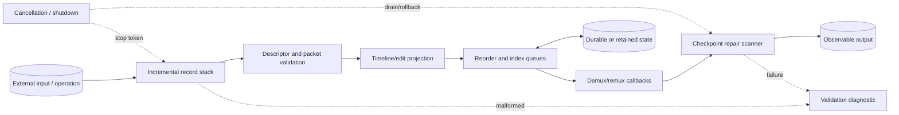
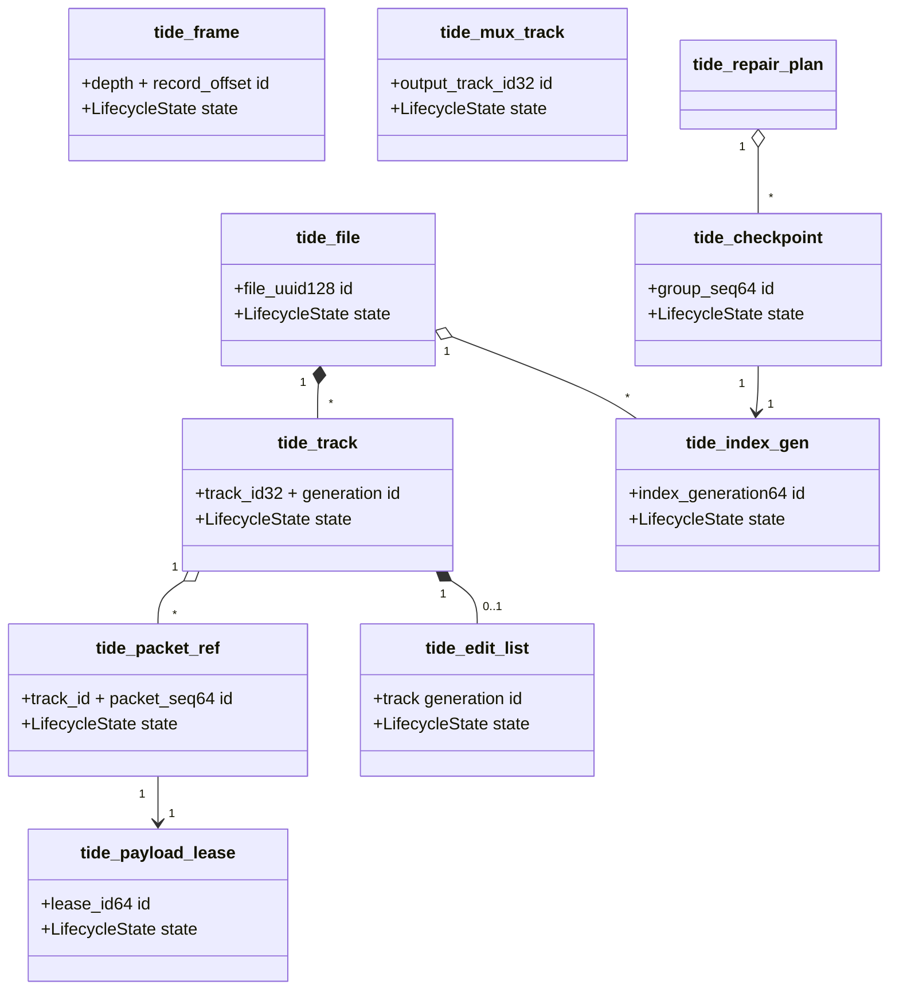
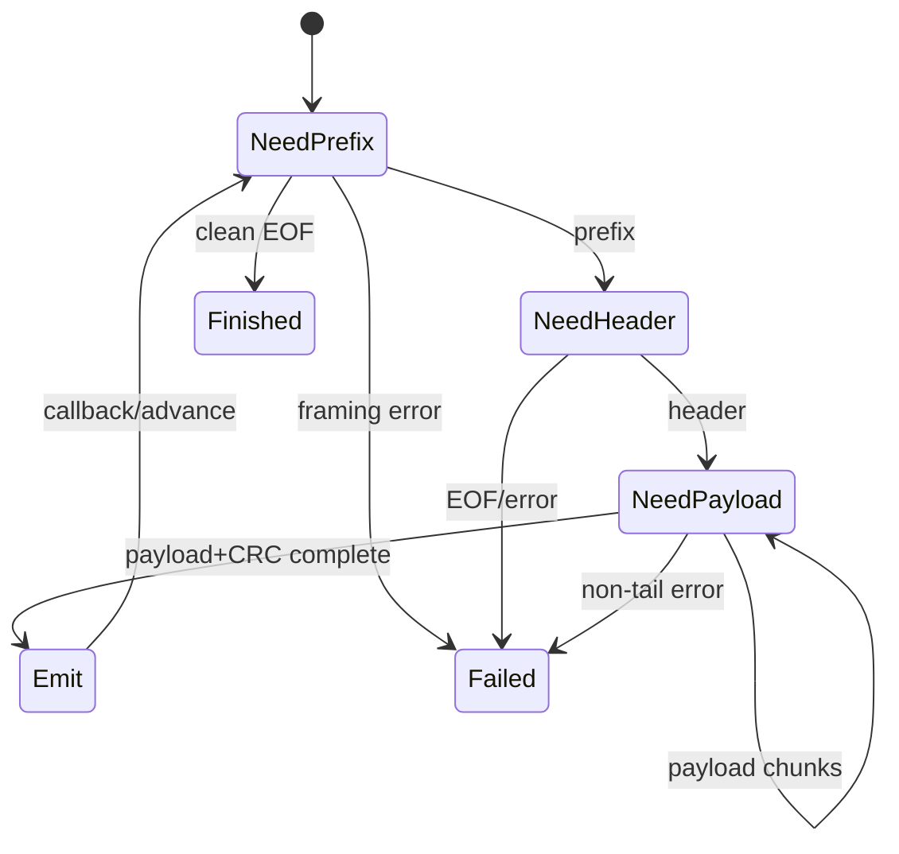
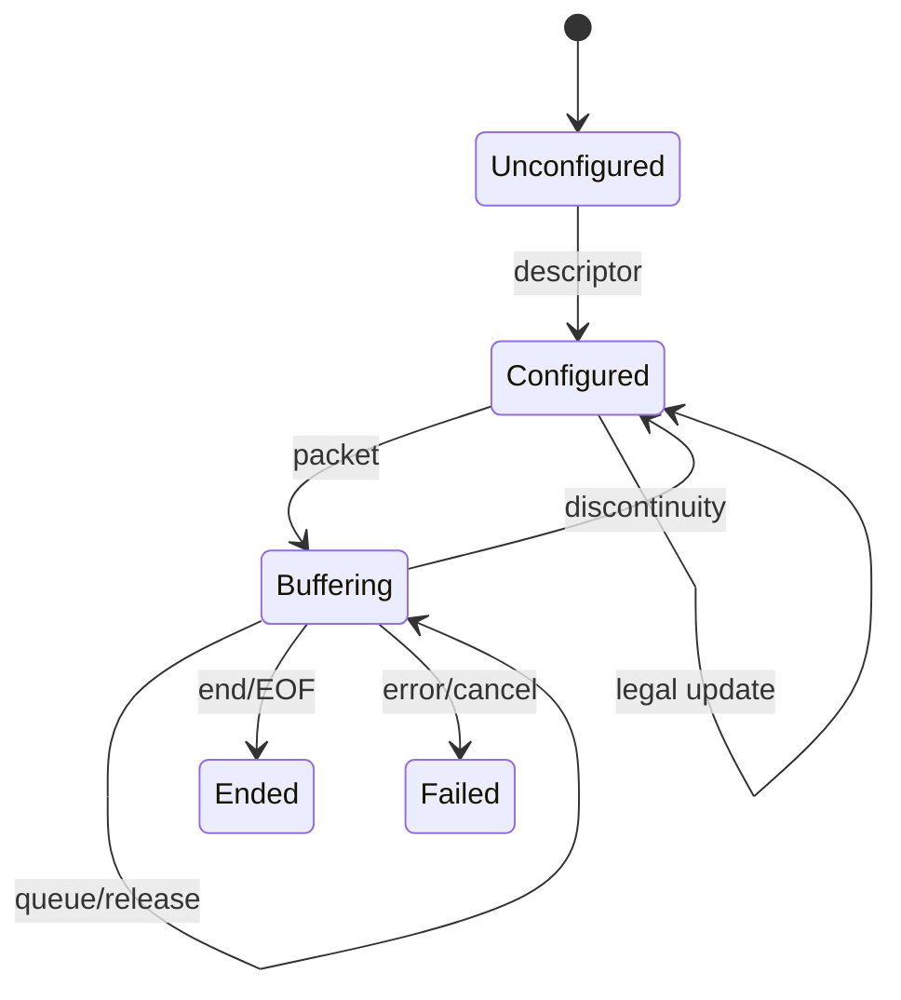

# 1. Project Identity

| Item | Specification |
| --- | --- |
| Name | Tide — Streaming Media Container Toolkit |
| Description | A C17 parser, validator, timeline indexer, demultiplexer, remultiplexer, and repair scanner for an original nested media container designed for partial files and arbitrary input chunking. |
| Language | C17 |
| Platforms | Linux x86-64/AArch64 with POSIX I/O; portable byte-stream core |
| Source size | MVP 9,000–12,000 lines; full 25,000–34,000 lines |
| Test size | 11,000–16,000 lines |
| License | Proprietary internal license |

**Substantial because:** Tide combines nested record parsing, independent time bases, edit-list projection, out-of-order packet tables, incremental seek indexing, remultiplexing, and damaged-tail recovery.

# 2. Product Definition

**Problem/users:** Local media tools need a bounded, inspectable container that can be read before completion and repaired after interrupted writing. Users: media-pipeline engineers, capture-tool authors, test-lab developers, and applications embedding local playback/export utilities

| Use case | Input | Result |
| --- | --- | --- |
| Growing capture playback | A file being appended by a recorder | Demux validated complete packets, update provisional index, and report incomplete tail without blocking on a final footer. |
| Timeline normalization | Several tracks with distinct time bases and edit lists | Emit normalized presentation events in one chosen output time base with exact rounding policy. |
| Interrupted-recording repair | Truncated or partly corrupt tail | Scan from checkpoints, retain complete packet groups, rebuild indexes, and write a new repaired file. |

- **Inputs:** TIDE byte streams, arbitrary feed chunks, seekable files, track selection, output time-base/remux policy, cancellation, and repair limits
- **Outputs:** validated records, stream descriptors, packet events, seek indexes, remultiplexed TIDE files, repair plans, and diagnostics
- **Observable behavior:** monotonic logical consumption, deterministic timestamp mapping, exact packet bytes, explicit provisional/final index state, and no reads outside validated ranges
- **MVP:** header, nested groups, stream descriptors, packet records, one packet table, rational timestamps, simple edit lists, demux, sequential remux, partial-tail handling, and three fuzz targets
- **Full version:** multiple index generations, packet reordering, interleaving policy, discontinuities, richer edit lists, rolling checkpoints, repair scanning, mapped random access, parallel track decode queues, and compact index rewrite
- **Non-goals:** codec decoding/encoding, DRM, network transport, copying MP4/Matroska layouts, live device capture, or transcoding
- **Originality:** TIDE separates logical packet identity from physical order, places recoverable group checkpoints inside the stream, and models edits as rational source/output intervals.
- **Project-specific coverage:** The container explicitly covers nested records; stream descriptors and packet tables; rational time bases and checked timestamp conversion; edit lists; interleaving and bounded packet reordering; partial-file operation; seek-index construction; remultiplexing; repair scanning; strict offset and integer-overflow checks; and a streaming harness that feeds the same file through arbitrary chunk boundaries.

# 3. Engineering Difficulty Profile

| Source | Why difficult | Invariant consequence |
| --- | --- | --- |
| Nested streaming grammar | Containers and packet groups may span feeds and contain unknown optional records. | The parser must preserve parent remaining lengths and depth without recursion overflow. |
| Offset/length safety | Absolute, group-relative, and payload-relative offsets coexist. | Unchecked addition or signed conversion can point outside file or into another record. |
| Timeline transforms | Decode, presentation, duration, track time base, movie time base, and edit intervals interact. | Incorrect rounding or negative values reorder packets silently. |
| Packet reordering | Physical order may differ from presentation order within negotiated bounds. | Queues must release packets deterministically and account for gaps/discontinuities. |
| Partial file/recovery | A writer can stop inside any header, payload, group, index, or footer. | Readers must distinguish provisional valid prefix from invalid structure. |
| Buffer lifetime | Packet payload slices may point into feed windows, mapped files, or owned spill buffers. | Callbacks and indexes cannot retain ephemeral pointers. |

**Cross-phase validation:** A packet payload offset is checked against its enclosing group during parse, translated to an absolute file range, queued by decode timestamp, projected through edits, and then rewritten as a new group-relative offset during remux. Shallow framing-only or stateless implementations are incorrect.

# 4. System Architecture



- **Processes/threads:** The core decoder is single-owner and callback-driven.
- **Normal path:** read and validate the file header, enter nested groups with explicit remaining lengths, register stream descriptors, ingest packet headers and payload leases, normalize timestamps.
- **Malformed path:** stop at the first framing violation within a required group, release all pending payloads, return the last complete checkpoint and a typed offset/path diagnostic.
- **Cancel/shutdown:** set cancellation, stop source reads, flush no incomplete packet, drain/release callback-owned leases, discard unfinished output group, finalize only if the current record stack is complete, then destroy tracks before source mappings.
- **Recovery:** locate the newest valid checkpoint reachable through framing, rescan complete groups with strict bounds, reconstruct descriptor/packet/index state, ignore incomplete tail, and write repaired output to a new path before atomic replacement.

| Module | Responsibility | Input | Output | Owns | Invariant | Dependencies |
| --- | --- | --- | --- | --- | --- | --- |
| tide_decoder | Incremental nested record parser. | Byte feeds/end flag | Record callbacks/status | Frame stack, scratch | Consumed bytes never exceed validated frame boundaries. | tide_reader |
| tide_reader | Checked integers, slices, and stream cursor. | Byte windows | Primitive values/spans | Input window ref | All arithmetic checked before pointer creation. | tide_limits |
| tide_source | Memory/file/growing-file abstraction. | Read/seek requests | Owned or leased bytes | FD/mapping/buffers | A lease remains valid until explicit release. | POSIX adapter |
| tide_packet | Validates packet headers, tables, and payload ranges. | Packet records/groups | Packet refs | Packet metadata | Declared payload and side-data ranges do not overlap illegally. | tide_decoder |
| tide_time | Rational conversion and checked timestamp math. | Time bases/timestamps | Normalized values | No heap state | Conversions use documented rounding and overflow policy. | checked arithmetic |
| tide_edit | Projects packet intervals through edit lists. | Track edits/packet times | Presentation intervals | Canonical edit vector | Edits are ordered, nonoverlapping, and finite. | tide_time |
| tide_reorder | Buffers out-of-order packets within limits. | Packet refs/time/discontinuity | Ready packet refs | Per-track heap/ring | Packets released in deterministic presentation order. | tide_catalog |
| tide_demux | Applies selection and emits packets. | Catalog, packet refs | User callbacks/events | Callback queue, leases | Payload lease covers callback and no unselected payload is materialized unnecessarily. | tide_reorder |
| tide_mux | Interleaves tracks and writes canonical groups/index/footer. | Packet inputs/policy | TIDE bytes | Output group buffers | Physical order obeys policy and every offset is rewritten after layout freeze. | tide_time, tide_index |
| tide_repair | Scans checkpoints and writes recovered container. | Damaged source/limits | Repair plan/output | Candidate stack/index | Only complete validated records enter repaired output. | tide_decoder, tide_mux |

# 5. Proposed Repository Layout

```text
    tide/
    ├── CMakeLists.txt
    ├── cmake/{Warnings.cmake,Sanitizers.cmake,FuzzTargets.cmake}
    ├── include/tide/{tide.h,decoder.h,demux.h,mux.h,repair.h,error.h}
    ├── src/format/{decoder.c,reader.c,records.c,writer.c}
    ├── src/source/{source.c,file_source.c,memory_source.c}
    ├── src/model/{catalog.c,packet.c,time.c,edit.c}
    ├── src/index/{reorder.c,index_builder.c,index_reader.c}
    ├── src/demux/{demux.c,selection.c}
    ├── src/mux/{mux.c,interleave.c,layout.c}
    ├── src/repair/{checkpoint.c,scanner.c,repair_writer.c}
    ├── src/cli/{main.c,inspect_cmd.c,remux_cmd.c,repair_cmd.c}
    ├── tests/unit/{reader_test.c,time_test.c,edit_test.c,reorder_test.c}
    ├── tests/integration/{partial_file_test.c,remux_test.c,repair_test.c}
    ├── fuzz/{fuzz_decoder.c,fuzz_chunk_boundaries.c,fuzz_demux_remux.c}
    ├── tools/{tide_dump.c,tide_index_dump.c}
    ├── examples/{stream_demux.c,write_capture.c}
    ├── docs/{TIDE_FORMAT.md,TIMELINE.md,RECOVERY.md}
    ├── corpus/{decoder,chunked,roundtrip}/
    └── scripts/{run_fuzz.sh,make_partial_cases.py,benchmark.sh}
```

| Important file | Purpose |
| --- | --- |
| `src/format/decoder.c` | Explicit nested-frame stack and feed consumption contract. |
| `src/model/time.c` | One checked rational timestamp implementation. |
| `src/index/reorder.c` | Bounded release/gap/discontinuity policy. |
| `src/mux/layout.c` | Two-pass offset assignment with overflow checks. |
| `src/repair/scanner.c` | Checkpoint-led strict salvage, not blind magic scanning. |
| `fuzz/fuzz_chunk_boundaries.c` | Same file under arbitrary chunk partitions and `WouldBlock` events. |

Tests and fuzzers link production libraries; no duplicate decoder/state logic.

# 6. Core Data Model

| Entity | Role | Ownership | Mutability | Stable ID | Thread safety |
| --- | --- | --- | --- | --- | --- |
| tide_file | Logical container/catalog | Caller-owned opaque object | Mutable during parse then sealed | file_uuid128 | One owner |
| tide_frame | Active nested record boundary | Decoder stack slot | Mutable cursor | depth + record_offset | Decoder-confined |
| tide_track | Stream descriptor and timeline state | Catalog slot | Mutable until finalization | track_id32 + generation | Catalog lock/owner |
| tide_packet_ref | Packet metadata plus payload lease/range | Move-like explicit owner | Metadata immutable | track_id + packet_seq64 | Transferable |
| tide_payload_lease | Keeps feed/mapping/spill bytes alive | Reference-counted C handle | Immutable bytes | lease_id64 | Atomic refcount only |
| tide_index_gen | Seek entries for one observed prefix | Index builder/reader | Append then freeze | index_generation64 | Builder-owned/read-only |
| tide_checkpoint | Authenticated complete-prefix summary | Repair/index module | Immutable | group_seq64 | Value |
| tide_mux_track | Writer-side queue and time base | Mux object | Mutable | output_track_id32 | Mux-confined |
| tide_repair_plan | Validated ranges and omissions | Caller-owned result | Immutable after scan | source fingerprint | Read-only |



**Lifecycles/serialization:** Opaque C objects are initialized to zero-safe states and move through INIT → ACTIVE → SEALED/FAILED → DESTROYED. Invalid/transitional states are explicit; cache-only fields never serialize.

# 7. Custom Format or Protocol Specification

## TIDE-1 nested streaming container

| Rule | Definition |
| --- | --- |
| Magic | `54 49 44 45 31 0D 0A 1A (`TIDE1`)` |
| Endian | little-endian fixed integers; signed timestamps are two’s-complement i64 |
| Integers | u8/u16/u32/u64/i64; canonical ULEB128 lengths/counts; rational time bases are reduced u32 numerator/denominator |
| Alignment | records align to 8 bytes; payload alignment may be 1/4/16 and padding is zero/canonical |
| Versioning | file major/minor and required/optional feature words; each descriptor has a generation for legal updates |
| Integrity | CRC32C per record; checkpoints include rolling BLAKE3-like 256-bit digest adapter over complete groups; footer hashes index directory |
| Depth | 32 nested groups, 1024 edit entries per track, 1M packet-table entries per group under policy |
| Canonical | minimal varints, sorted descriptors/index entries, reduced time bases, zero padding, ordered edit intervals, reserved bits zero |
| Unknown | unknown skippable record types carry high bit; required unknowns invalidate enclosing group/file depending scope |
| Truncation | partial record/group at physical EOF is a provisional tail; complete prior packets remain available with `TIDE_PARTIAL` status |

### Header/footer and framing

| Field | Encoding | Constraint | Meaning |
| --- | --- | --- | --- |
| magic | 8 bytes | Exact | Container identifier. |
| major/minor | u16/u16 | Major 1 | Compatibility. |
| file_uuid | 16 bytes | Nonzero | Binds checkpoints/indexes. |
| movie_time_base | u32/u32 | Reduced, numerator/denominator >0 | Default normalized timeline. |
| required/optional_features | u64/u64 | Unknown required rejects | Feature behavior. |
| max_record_hint | u64 | Hint bounded by reader policy | Writer’s expected record maximum. |
| first_checkpoint_offset | u64 | 0 or validated record boundary | Optional acceleration. |
| header_crc32c | u32 | Covers header | Integrity. |

Record prefix: `type:u16, flags:u16, header_size:u16, alignment_log2:u8, reserved:u8, payload_size:ULEB128, sequence:ULEB128`; type header, payload, zero padding, and CRC follow. GROUP records declare child-byte length; child records must end exactly at the group boundary.

#### Footer layout

The final `FOOTER` is an ordinary framed record and therefore inherits record CRC, padding, and sequence rules.

| Footer field | Encoding | Constraint | Meaning |
| --- | --- | --- | --- |
| `file_length` | little-endian u64 | Equals the byte immediately after the complete footer | Rejects appended or truncated final files. |
| `index_directory_offset` | little-endian u64 | Zero or a validated `INDEX_DIRECTORY` record boundary | Selects final seek-index generations. |
| `last_checkpoint_sequence` | canonical ULEB128 | References a prior complete checkpoint only | Binds the footer to a recoverable prefix. |
| `file_digest` | 32 bytes | Covers the canonical file prefix excluding the digest field itself | Commits descriptors, packets, edits, indexes, and ordering. |

A partial or growing file need not contain a footer. In that case only records through the last authenticated checkpoint or contiguous validated prefix are usable, and completeness remains explicitly false.

| Type | Code | Payload | Constraints | Semantics |
| --- | --- | --- | --- | --- |
| GROUP | 0x0001 | Group kind, child bytes, group sequence | Exact child boundary | Nests descriptors, packets, or indexes. |
| STREAM_DESC | 0x0010 | Track ID/generation, media kind, codec tag, time base, opaque config | Unique live generation | Declares a logical stream. |
| PACKET | 0x0020 | Track, packet seq, DTS/PTS/duration, flags, payload | Payload within record; timestamps valid | One opaque encoded packet. |
| PACKET_TABLE | 0x0021 | Delta-coded packet metadata and group-relative ranges | Sorted by physical offset | Compact metadata for many payloads. |
| EDIT_LIST | 0x0030 | Output start/duration, source start/rate | Ordered, nonoverlapping | Maps source track time to presentation time. |
| DISCONTINUITY | 0x0031 | Track/all, new epoch, reason | Monotonic epoch | Resets reorder/timestamp continuity. |
| SEEK_INDEX | 0x0040 | Track/time/packet/group offsets | Offsets hit validated packet boundaries | Provisional or final seek points. |
| CHECKPOINT | 0x0050 | Complete group seq, offset, rolling digest, descriptor summary | References prior prefix only | Recovery anchor. |
| INDEX_DIRECTORY | 0x0060 | Index generations and ranges | Sorted; no overlap | Selects newest applicable index. |
| FOOTER | 0x007F | File length, directory offset, digest | Last complete record | Finalizes a closed file. |

### Examples and streaming behavior

- **Valid 1:** Header with 1/1000 movie base; STREAM_DESC track 1 base 1/48000; two PACKET records at DTS 0 and 1024; provisional SEEK_INDEX points to the first packet.
- **Valid 2:** An EDIT_LIST maps output [0,2s) to source [1s,3s), followed by out-of-order physical packets whose PTS values are released in presentation order within a declared reorder depth.

- **Malformed 1:** GROUP child length ends halfway through a PACKET CRC: return partial only at physical EOF; otherwise reject group framing and stop.
- **Malformed 2:** PACKET payload offset plus size overflows u64 or exceeds its record: reject before forming a pointer/lease.
- **Malformed 3:** Time base denominator is zero or fraction is unreduced in canonical mode: reject descriptor.
- **Malformed 4:** SEEK_INDEX entry points into packet payload rather than record start: ignore/reject that index generation; packets remain sequentially readable.

- **Partial input:** The decoder keeps a fixed prefix scratch and explicit parent frame stack. It may emit packet header before payload only as a pending token, never a usable packet. Large payloads are delivered through lease-backed chunks or source ranges. Feed segmentation cannot alter record callbacks, timestamps, or diagnostics; growing sources may return `WOULD_BLOCK` without implying EOF.

# 8. State Machines and Lifecycle Rules

### Incremental nested decoder

**Scope:** tide_source, tide_decoder, frame stack, payload leases, catalog callbacks, and partial-tail status.

| From | Event | Guard | Action | To |
| --- | --- | --- | --- | --- |
| NeedPrefix | bytes | prefix complete | validate type/length; reserve frame | NeedHeader |
| NeedHeader | bytes | type header complete | parse fields; validate parent remaining | NeedPayload |
| NeedPayload | bytes/range | payload progress | stream/copy/lease bytes | NeedPayload |
| NeedPayload | payload complete | padding/CRC pending | validate integrity | Emit |
| Emit | callback returns | leases accounted | advance parent; push/pop GROUP | NeedPrefix |
| NeedPrefix | EOF at boundary | stack empty or complete prefix | finalize complete/partial status | Finished |
| NeedHeader | EOF/corruption | always | release pending state; report offset/path | Failed |



- **Illegal transitions:** emitting a record before CRC/bounds, consuming beyond parent remaining, retaining nonleased feed pointers, or accepting clean EOF with nonempty required group stack.
- **Cancellation:** returns `CANCELLED` after releasing pending payload/frame state; previously emitted packet leases remain caller-owned.
- **Timeout:** source deadlines surface as WOULD_BLOCK or cancellation; parser state is unchanged between feeds.
- **Recovery:** repair mode records last complete checkpoint/frame boundary but still uses the same production parser for candidates.
- **Transition invariants:** cursor and parent remaining are monotonic; stack depth bounded; each consumed byte belongs to one record/padding region.

### Track packet reorder, edit projection, and release

**Scope:** catalog track generation, packet validator, edit mapper, reorder queue, demux callback, and seek index builder.

| From | Event | Guard | Action | To |
| --- | --- | --- | --- | --- |
| Unconfigured | STREAM_DESC | valid new track generation | create time/edit/reorder state | Configured |
| Configured | PACKET | sequence/range valid | normalize timestamps; queue and index | Buffering |
| Buffering | release condition | watermark/depth/discontinuity permits | project edits; emit/drop packet | Buffering |
| Buffering | DISCONTINUITY | epoch increases | flush/drop by policy; reset continuity | Configured |
| Buffering | track end/EOF | tail status known | drain complete packets; mark provisional/final | Ended |
| Configured | descriptor update | prior generation ended | replace descriptor and increment handle generation | Configured |
| Buffering | error/cancel | always | release all packet refs | Failed |



- **Illegal transitions:** packet before descriptor, timestamp use with zero time base, update while old generation has queued packets, or release after Failed.
- **Cancellation:** queued payload leases are released; callbacks already owning moved packet refs remain valid.
- **Timeout:** growing-file idle timeout yields provisional stop, not synthetic end-of-track, unless caller requests finalization.
- **Recovery:** scanner rebuilds state from latest descriptor summary/checkpoint then replays complete packets.
- **Transition invariants:** queue bytes/count within cap; released presentation keys nondecreasing within epoch; every packet ref/lease released once.

# 9. Memory Ownership and Resource Management

The C implementation uses explicit `*_init`, `*_reset`, `*_move`, and `*_destroy` conventions. Every owning field is documented; cleanup labels unwind in reverse acquisition order; borrowed spans carry a length and may not outlive the owner. Opaque public handles include a generation and registry pointer, while raw pointers never cross an ownership boundary without an accompanying contract.

| Concern | Rule |
| --- | --- |
| Allocation domains | caller allocator, decoder frame stack, source lease objects, catalog arrays, per-track reorder heaps, mux group buffers, repair scan workspace |
| Transfer | `tide_packet_ref_move(dst,src)` transfers payload lease and clears source; callbacks declare BORROW or TAKE |
| Borrowing/slices | record headers and small metadata pointers expire on callback return; payload range requires `tide_payload_lease_retain` or move |
| Shared ownership | only payload leases/mappings use atomic refcounts; tracks/catalogs have one explicit owner |
| Arenas/pools | decoder uses fixed/bounded stack; repair candidates use resettable arena per group; no arena pointer enters public retained objects |
| Handles | track handle `{slot,generation}`; source range `{source_id,generation,offset,length}` validates on map/read |
| Iterator invalidation | catalog/index mutation invalidates iterators; public enumeration uses callback or snapshot copy |
| Reallocation | arrays store indices/offsets; functions that may grow document pointer invalidation; packet payload blocks never realloc while leased |
| Plugins/callbacks | codec payloads are opaque; optional metadata handlers register before parse and unregister after all decoder instances destroy |
| Thread handoff | worker queue owns moved packet refs; return paths release or move explicitly; no borrowed decoder state crosses threads |
| Eviction/snapshots | mapped windows and spill buffers evict only at lease count zero; index snapshots own copied entries or mapping refs |
| Mappings/files | mapping object owns fd and generation; truncation/replacement invalidates new acquisition but existing immutable mapping remains until release |
| Unwinding | each C function uses one cleanup label, initialized locals, and reverse-order destroy. |
| Shutdown | cancel source → stop decoder → release pending packet/reorder queues → destroy index/catalog → release source leases/mappings → close output/source |

Every retained observer is protected by an owner/lease and stable generation; raw addresses are never durable identities.

# 10. Core Algorithms

### 1. Iterative nested record decode

**Purpose/I/O:** Parse bounded nested groups under arbitrary feeds. feed bytes/end flag → callbacks/status  
**Preconditions:** decoder initialized and not terminal  
**Procedure:** `fill fixed prefix → checked-decode lengths → verify child fits parent → push frame for GROUP or stream payload → verify padding/CRC → emit and decrement parent → pop exact-end frames`  
**Complexity/failures:** O(bytes), O(depth) memory; overflow, depth, truncation, CRC, callback error  
**Interactions/invariant:** decoder, source, catalog; no cursor beyond validated window/parent; split-independent callbacks

### 2. Checked rational timestamp conversion

**Purpose/I/O:** Map timestamps between time bases deterministically. i64 value, source/destination rationals, rounding mode → i64  
**Preconditions:** positive reduced denominators  
**Procedure:** `cancel common factors with gcd → use widened checked multiply/divide → apply floor/ceil/nearest-even policy → detect range overflow → preserve sentinel separately`  
**Complexity/failures:** O(log max factor); zero base, overflow, invalid sentinel use  
**Interactions/invariant:** time, edit, mux, index; monotonic for monotonic inputs under same mode; exact values stay exact

### 3. Edit-list interval projection

**Purpose/I/O:** Map source packet intervals to output presentation intervals. packet PTS/duration and canonical edits → zero or more clipped intervals  
**Preconditions:** ordered nonoverlapping edits  
**Procedure:** `find first overlapping source interval → intersect packet interval → scale by rational edit rate → translate to output start → emit clipped pieces in edit order → mark discontinuities/gaps`  
**Complexity/failures:** O(log E + overlaps); overflow, invalid rate, fragment cap  
**Interactions/invariant:** edit, time, demux, remux; output pieces lie inside edits and do not overlap unexpectedly

### 4. Bounded packet reorder release

**Purpose/I/O:** Emit deterministic presentation order despite physical/DTS order. packet refs, reorder depth/window, discontinuities → ready refs  
**Preconditions:** track configured and packet keys valid  
**Procedure:** `insert by (epoch,PTS,DTS,seq) → charge bytes/count → advance watermark from DTS/max depth → pop all keys below watermark → on discontinuity drain/drop policy → release leases on failure`  
**Complexity/failures:** O(log n) per packet; quota, duplicate conflict, timestamp overflow  
**Interactions/invariant:** reorder, demux, index; released key nondecreasing; retained budget exact

### 5. Incremental seek-index construction

**Purpose/I/O:** Build usable index entries before final footer. validated packet/group events → provisional index generations  
**Preconditions:** physical record start known and track descriptor valid  
**Procedure:** `select candidate by key/discontinuity/time spacing → store track time, packet seq, group/record offset → validate monotonicity → seal generation at checkpoint → merge/replace entries on finalization`  
**Complexity/failures:** O(p) time, O(entries); offset overflow, nonmonotonic policy, memory cap  
**Interactions/invariant:** index, packet, checkpoint; entry points to a validated boundary in same file UUID/prefix

### 6. Two-pass remultiplex layout

**Purpose/I/O:** Interleave selected packets and rewrite all offsets canonically. packet streams, target bases, interleave policy → TIDE output  
**Preconditions:** descriptors/edits validated; payload refs live  
**Procedure:** `normalize scheduling keys → select next track within lead/lag bounds → accumulate one bounded group plan → compute record sizes/alignment/offsets checked → write headers/payloads/index → seal checkpoint/footer`  
**Complexity/failures:** O(P log T + bytes); no payload, offset overflow, output error, cancellation  
**Interactions/invariant:** mux, time, index, writer; payload bytes unchanged; offsets target final layout; physical policy deterministic

# 11. Public API and Tooling Interfaces

```text
tide_status tide_decoder_init(tide_decoder*, const tide_limits*, const tide_callbacks*, void* user);
tide_status tide_decoder_feed(tide_decoder*, const uint8_t* data, size_t size, int end, size_t* consumed);
tide_status tide_demux_open(tide_demux**, tide_source*, const tide_demux_options*);
tide_status tide_demux_next(tide_demux*, tide_packet_ref* out);
tide_status tide_mux_write_packet(tide_mux*, tide_packet_ref* moved_packet);
tide_status tide_repair_scan(tide_source*, const tide_repair_options*, tide_repair_plan**);
```

| Command | Purpose | Example |
| --- | --- | --- |
| `tide inspect` | Print hierarchy/descriptors/index status. | `tide inspect capture.tide --records --timeline` |
| `tide demux` | Emit selected packet metadata/payload files. | `tide demux capture.tide --track 2 --out packets/` |
| `tide remux` | Select, normalize, and rewrite tracks. | `tide remux in.tide out.tide --tracks 1,3 --time-base 1/1000` |
| `tide index` | Build or validate seek indexes. | `tide index capture.tide --sidecar capture.tidx` |
| `tide repair` | Scan and write a repaired container. | `tide repair broken.tide repaired.tide --report repair.json` |

- **Configuration:** C option structs with size/version fields define caps, strictness, track selection, rounding, reorder, callbacks, and allocator; CLI config is TOML-like but converted to the same structs
- **Exit codes:** `0` success, `2` usage/config, `3` rejected input, `4` limit, `5` cancelled, `6` documented partial result, `10` invariant failure.
- **Errors/logging:** FORMAT, TRUNCATED, UNSUPPORTED, INTEGRITY, TIMELINE, INDEX, RESOURCE, CANCELLED, IO, PARTIAL, INTERNAL. Logs carry stable code/component and only validated IDs, ranges, and offsets.
- **Stability/versioning:** C ABI uses opaque structs and versioned option/callback tables; decoder and packet-ref ownership stabilize before advanced mux policies Tool semantic versioning is independent from Section 7 format compatibility; no pre-1.0 ABI promise.

# 12. Error Model and Defensive Behavior

`tide_error` contains stable code, severity, absolute validated offset, record-type path, track/generation, packet sequence, and cause. Checked arithmetic precedes every allocation/offset/time conversion. Maximum single allocation: 32 MiB single allocation and 256 MiB aggregate default; packet payloads above contiguous threshold remain source-range/chain leases. Explicit stacks enforce nesting caps. Cancellation is sticky; partial results carry completeness/trust; cleanup and deterministic diagnostics are mandatory.

# 13. Concurrency Model

MVP objects are single-thread-owned; full demux can transfer packet refs to per-track workers while parser/index/mux ordering stays serialized.

| Concern | Design |
| --- | --- |
| Workers/loops | one parser loop, optional bounded track consumers, one mux writer, optional repair reader/writer pipeline |
| Queues | SPSC/MPSC implementation may use mutexes; queues charge packet metadata and payload lease bytes |
| Handoff | only moved `tide_packet_ref` and immutable descriptor snapshots cross threads |
| Locks | source mapping cache → catalog snapshot lock → queue; decoder/mux/reorder objects never lock internally |
| Lock-free | atomic lease refcount only; lock-free queues require measured benefit and proof of reclamation |
| Backpressure | source reads pause when packet queues or leases exceed caps; mux input returns WOULD_BLOCK |
| Shutdown | set atomic cancel, wake source/queues, join consumers, drain/release refs, finalize or discard output, destroy source last |
| Determinism | single-thread mode plus virtual source events; worker delivery order cannot change mux order because coordinator sequences packets |
| Not thread-safe | decoder, demux cursor, mux, reorder queue, repair scanner, and mutable index builder |

# 14. Fuzzing Architecture

Harnesses map bytes to production entry points and state machines; only operation decoding is harness-specific.

### Harness 1: `tide_decoder_fuzz`

- **Entry/input:** `tide_decoder_feed`; raw container bytes and strict/end mode
- **Setup/state:** bounded allocator/callback recorder; destroy decoder/leases nested records and catalog callbacks
- **Limits/determinism:** 4 MiB; 64 MiB, depth 32, 200 ms; memory source, fixed callbacks
- **Assertions:** no overread/leak, monotonic consumed, stable error offset/path, canonical reparse for accepted data
- **Performance omissions:** payload hash may use fast deterministic adapter; CRC/bounds stay
- **Coverage:** headers, groups, all records, unknowns, truncation, offsets
- **Seeds/dictionary:** minimal headers/groups/record types and byte dictionary
- **Minimize/dedup/reproduce:** coverage merge; dedup by code/path/stack; exact `.tide` bytes. Convert exact input to a named regression.

### Harness 2: `tide_chunk_boundary_fuzz`

- **Entry/input:** `decode_via_chunk_plan(FileBytes, Plan)`; same file bytes plus arbitrary chunk sizes, WOULD_BLOCKs, and EOF point
- **Setup/state:** growing memory source and event recorder feed boundaries, partial payload leases, provisional EOF
- **Limits/determinism:** 8 MiB; 16k feeds, 128 MiB, 500 ms; plan encoded in input
- **Assertions:** all complete plans match contiguous decode events; partial plans expose same valid prefix; no duplicate callback
- **Performance omissions:** none
- **Coverage:** every split in prefixes/varints/headers/payload/CRC/groups
- **Seeds/dictionary:** small valid/partial files with split tokens
- **Minimize/dedup/reproduce:** jointly shrink bytes and plan; dedup by event-stream difference; file plus split/WouldBlock vector. Convert exact input to a named regression.

### Harness 3: `tide_demux_remux_fuzz`

- **Entry/input:** `demux_remux_reopen(Bundle)`; container bytes, selection, target time base, reorder/interleave options, fault/cancel point
- **Setup/state:** memory source/output, production demux/mux/reader and simple packet timeline model descriptors, edits, reorder, index, output layout, reopen
- **Limits/determinism:** 8 MiB; 64 tracks, 10k packets, 256 MiB, 2 s; virtual source and fixed policy
- **Assertions:** accepted output validates; selected opaque payloads and projected timestamps match model; failed output unpublished
- **Performance omissions:** codec work nonexistent; expensive index density reduced by option only
- **Coverage:** timeline overflow, edit clipping, interleave, partial source, repair/publish faults
- **Seeds/dictionary:** multitrack/edit/reorder/partial specimens and option tokens
- **Minimize/dedup/reproduce:** record-aware reducer and option shrink; dedup by logical packet diff/invariant; input file plus option/fault manifest. Convert exact input to a named regression.

- **Sanitizers:** ASan with frame pointers; UBSan integer/bounds/implicit-conversion checks; LSan with reset hooks; TSan plan: run packet transfer, mapping-lease eviction, cancellation, and mux backpressure tests with two to eight workers; C core remains single-owner and TSan annotations document handoff
- **Hardening:** `_FORTIFY_SOURCE=3` where supported, strict conversions, poisoned pools/guard pages, checked spans and integers.
- **Campaign:** parser continuous; sequence/end-to-end rotating; nightly merge/minimize and coverage by parser/state/recovery/error transition. Deduplicate by sanitizer stack plus stable error/invariant/state key.

# 15. High-Complexity Test Surfaces

| Surface | Modules | Invariant at risk | Test | Product reason |
| --- | --- | --- | --- | --- |
| Nested group ends at feed boundary | Decoder, Source | Parent remaining reaches zero exactly once. | Split at every byte around child end. | Streaming input is primary. |
| Packet payload spans mapped windows | Source, Packet, Demux | Lease covers every payload segment. | Tiny windows and delayed callback release. | Large files cannot be mapped wholly. |
| Timestamp conversion near i64 limit | Time, Edit, Index | Checked rounding never wraps or reverses order. | Property cases around factors/limits. | Long timelines/high clocks are valid. |
| Edit clips reordered packet | Edit, Reorder, Demux | Clipping occurs after correct ordering/epoch. | Cross edit edges with B-frame-like PTS order. | Real packet order differs. |
| Index points into truncated tail | Index, Decoder | Invalid generation ignored; valid prefix remains. | Truncate each index target. | Growing files have provisional indexes. |
| Descriptor update with queued packets | Catalog, Reorder | Old-generation packets cannot use new time base/config. | Update before/after drain. | Track formats can change at discontinuity. |
| Partial CRC at physical EOF | Decoder, Repair | Reported as partial tail, not accepted record. | Cut each CRC byte. | Interrupted recording common. |
| Unknown skippable nested record | Decoder, Group stack | Skip consumes exact framed range. | Insert at every depth. | Forward compatibility. |
| Mux offset changes after alignment | Layout, Index | Index references final record starts. | Vary payload/alignment combinations. | Two-pass writer is necessary. |
| Cancellation with caller-owned packet | Demux, Lease | Moved packet remains valid; internal queues drain. | Cancel after TAKE callback. | Ownership crosses API. |
| Repair checkpoint digest mismatch | Repair, Decoder | Fallback only to earlier authenticated checkpoint. | Corrupt summary/digest independently. | Tail metadata may be damaged. |
| Reorder quota under sparse times | Reorder, Catalog | Bound enforced without leaking refs. | Many far-future PTS packets. | Adversarial files can delay release. |
| Zero-duration/edit rate edge | Edit, Time | Policy explicit and deterministic. | Cross product zero duration/rates. | Timeline corner cases are legitimate. |
| Allocation failure building index | Index, Demux | Packets continue sequentially or fail per policy; no stale partial index. | Fail every growth point. | Indexes are optional acceleration. |
| Growing source replaced/truncated | Source, Mapping | Generation mismatch stops new leases safely. | Mutate source identity during parse. | Capture files may rotate. |

# 16. Testing Strategy

| Subsystem | Named test | Expected property |
| --- | --- | --- |
| Format/streaming | HeaderCanonicalRoundTrip | Canonical bytes stable. |
| Format/streaming | GroupChildLengthExact | Under/overrun rejected. |
| Format/streaming | EveryRecordEverySplit | Event stream split-independent. |
| Format/streaming | UnknownOptionalSkip | Next frame remains aligned. |
| Format/streaming | PartialTailStatus | Complete prefix retained only at EOF. |
| Time/edits | RationalExactConversion | Exact multiples unchanged. |
| Time/edits | NearestEvenTieCases | Rounding policy fixed. |
| Time/edits | TimestampOverflowRejected | No wrap/saturation. |
| Time/edits | EditClipProducesExpectedPieces | Intervals exact. |
| Time/edits | EditGapDropsPacket | No false presentation event. |
| Packets/reorder | PacketRangeInsideRecord | All slices bounded. |
| Packets/reorder | ConflictingDuplicatePacket | Stable rejection policy. |
| Packets/reorder | ReorderDepthRelease | Order deterministic. |
| Packets/reorder | DiscontinuityResetsEpoch | Old queue cannot cross. |
| Packets/reorder | DescriptorGenerationIsolation | Old packets retain old semantics. |
| Index/seek | ProvisionalIndexBoundary | Entries target complete packet starts. |
| Index/seek | BadIndexIgnoredSequentialReadWorks | Acceleration never authoritative. |
| Index/seek | IndexGenerationSelection | Newest applicable prefix chosen. |
| Index/seek | SeekThenDemuxMatchesLinear | Packet sequence equivalent. |
| Index/seek | IndexAllocationFailurePolicy | No corrupt partial index exposed. |
| Mux/repair | DemuxRemuxPayloadIdentity | Opaque bytes unchanged. |
| Mux/repair | InterleavePolicyBoundedLead | Track lead/lag respected. |
| Mux/repair | LayoutAlignmentNoOverlap | Offsets checked. |
| Mux/repair | CheckpointFallback | Earlier valid anchor used. |
| Mux/repair | RepairDropsIncompleteGroup | Output fully validates. |
| Fault/concurrency/regression | LeaseRetainReleaseBalance | No leak/double release. |
| Fault/concurrency/regression | CancelEveryParserState | Bounded cleanup. |
| Fault/concurrency/regression | WorkerHandoffOwnsPacket | No borrowed pointer crosses. |
| Fault/concurrency/regression | GrowingWouldBlockIdempotent | State unchanged without bytes. |
| Fault/concurrency/regression | FuzzerRegressionAllProfiles | Minimized cases stable under sanitizers. |

Coverage includes unit, integration, property, round-trip, malformed, crash/recovery, allocation-failure, cancellation, concurrency, soak, platform, compatibility, and fuzzer regressions. Reference: a vector of opaque packets per track with exact rational interval projection, simple sorted reorder, and logical remux event comparison.

# 17. Build System and Developer Tooling

- **CMake/toolchains:** top-level core/CLI/tests/fuzz targets; Clang 18+ and GCC 14+; warnings-as-errors for first-party code.
- **Profiles:** Debug, Release, RelWithDebInfo, ASan+UBSan, TSan, Coverage, Fuzz.
- **Tools:** clang-tidy/scan-build, clang-format, Markdown lint; pinned, license-reviewed minimal dependencies.
- **Reproducibility:** sorted canonical output, fixed seeds, recorded compiler/features, no wall-clock data in normative artifacts.
- **Commands/CI:** configure/build, `ctest`, fuzz corpora; compile, tests, sanitizers, analysis, fuzz smoke, coverage, package, periodic recovery/soak.

# 18. Performance and Resource Budgets

| Metric | MVP | Full | Limit behavior |
| --- | --- | --- | --- |
| Parse throughput | >=500 MiB/s payload-heavy | >=1.5 GiB/s mapped/zero-copy | Backpressure/typed error; checks remain. |
| Demux latency | <2 ms p99 growing local file | <1 ms p99 for ready packet | WOULD_BLOCK without state loss. |
| Memory | <=128 MiB default | <=512 MiB configurable | Pause reads/evict zero-lease windows. |
| Tracks/packets | 64 tracks; 10M packets tested | 1024 tracks; 2^63-1 seq representable | Reject policy cap before allocation. |
| Record/payload | 64 MiB record; streamed payload | 1 GiB record; no contiguous requirement | Stream or reject. |
| Depth/edits | depth 16; 256 edits | depth 32; 1024 edits | Explicit limit error. |
| Startup index | <300 ms / 1M entries | <2 s / 10M mapped entries | Use provisional scan with progress. |
| Seek | <20 ms indexed local | <5 ms warm mapped index | Fallback sequential when index invalid. |
| Repair | >=200 MiB/s after checkpoint | >=500 MiB/s | Return resumable plan on budget. |
| Fuzz speed | >30k decoder/s; >3k chunk plans/s | >60k / >8k | Bound payload copy, not validation. |

Measured on documented hardware/corpora. Limits return typed errors or backpressure; checks are never silently disabled.

# 19. Implementation Roadmap

| Phase | Deliverables | Depends | Required tests | Exit | Main risk |
| --- | --- | --- | --- | --- | --- |
| 0 — foundations | CMake presets, coding rules, checked arithmetic, error/result types. | None | Build smoke test; error-code snapshot; sanitizer startup. | All profiles configure and one empty end-to-end command exits predictably. | Toolchain drift and premature dependency choices. |
| 1 — minimal data model | Stable IDs, lifecycle enums, ownership containers, immutable/mutable boundaries, and debug invariant checks. | Phase 0 | Construction/destruction, stale-handle, allocation-failure, and serialization-boundary tests. | Objects can be created, invalidated, inspected, and destroyed without leaks. | Choosing identities that cannot survive later compaction or reuse. |
| 2 — basic format/parser | Primitive codec, framing, bounded reader/writer, unknown-record policy, and canonical serializer. | Phase 1 | Golden examples, malformed corpus, streaming split matrix, and round-trip properties. | Parser consumes all valid examples and rejects malformed data with offsets. | Ambiguous length, offset, or version semantics. |
| 3 — first useful path | CLI and library path that turns a real input into a useful output using the production model. | Phase 2 | End-to-end fixtures, cancellation, resource caps, and deterministic output tests. | A documented MVP workflow works on clean and malformed input. | Leaking parser assumptions into the public API. |
| 4 — stateful features | Cross-object state machines, sequence operations, generations, and persistence/update semantics. | Phase 3 | Model-based sequences, illegal transitions, replay/undo, and stale-reference tests. | State transitions are explicit and invariant-checked. | Combinatorial state growth and hidden temporal coupling. |
| 5 — recovery / incremental / concurrency | Recovery scanner or replay, incremental invalidation, bounded workers, backpressure, and graceful shutdown. | Phase 4 | Crash injection, partial input, thread handoff, restart, and deterministic scheduling tests. | Interrupted work resumes or fails according to documented semantics. | Recovery accepting corrupt state or concurrency changing results. |
| 6 — hardening and fuzzing | Three production-linked fuzz targets, sanitizer matrices, allocation fault injection, and regression workflow. | Phases 2–5 | Corpus smoke, coverage gates, leak reset, and minimized reproducer conversion. | No sanitizer findings in regression corpora; target throughput meets budget. | Harnesses bypassing expensive but correctness-critical logic. |
| 7 — performance and polish | Profiling, budget enforcement, packaging, compatibility fixtures, complete documentation, and soak runs. | All prior phases | Benchmark reproducibility, long soak, compatibility, and release-package tests. | Full acceptance checklist is green on the reference platform. | Optimization weakening validation or expanding scope. |

## Implementation tickets

| ID | Description | Prerequisite | Definition of done |
| --- | --- | --- | --- |
| TIDE-001 | Set up C17 targets, warnings, sanitizers, and allocator hooks. Separate core, CLI, tests, tools, and fuzzers. | None | Set up C17 targets, warnings, sanitizers, and allocator hooks is integrated; boundary/failure tests, stable diagnostics, and sanitized runs pass. |
| TIDE-002 | Implement checked integer/range/time primitives. Cover add/mul/alignment/gcd/widened conversion. | TIDE-001 | Implement checked integer/range/time primitives is integrated; boundary/failure tests, stable diagnostics, and sanitized runs pass. |
| TIDE-003 | Define C status/error and zero-safe lifecycle conventions. Make every object cleanup-safe. | TIDE-002 | Define C status/error and zero-safe lifecycle conventions is integrated; boundary/failure tests, stable diagnostics, and sanitized runs pass. |
| TIDE-004 | Build memory/growing/faultable source adapters. Control reads, WOULD_BLOCK, EOF, replacement, and I/O faults. | TIDE-003 | Build memory/growing/faultable source adapters is integrated; boundary/failure tests, stable diagnostics, and sanitized runs pass. |
| TIDE-005 | Define opaque file/decoder/catalog/packet/index handles. Freeze public ownership and generation rules. | TIDE-004 | Define opaque file/decoder/catalog/packet/index handles is integrated; boundary/failure tests, stable diagnostics, and sanitized runs pass. |
| TIDE-006 | Implement payload lease and move/retain/release APIs. Support feed, mapping, spill, and worker ownership. | TIDE-005 | Implement payload lease and move/retain/release APIs is integrated; boundary/failure tests, stable diagnostics, and sanitized runs pass. |
| TIDE-007 | Implement track slot generations and descriptor snapshots. Prevent update/reuse confusion. | TIDE-006 | Implement track slot generations and descriptor snapshots is integrated; boundary/failure tests, stable diagnostics, and sanitized runs pass. |
| TIDE-008 | Implement explicit nested frame stack. Avoid recursive parser ownership. | TIDE-007 | Implement explicit nested frame stack is integrated; boundary/failure tests, stable diagnostics, and sanitized runs pass. |
| TIDE-009 | Implement TIDE header and primitive decoder. Validate version, features, time base, and CRC. | TIDE-008 | Implement TIDE header and primitive decoder is integrated; boundary/failure tests, stable diagnostics, and sanitized runs pass. |
| TIDE-010 | Implement generic record framing and incremental feed. Handle arbitrary prefixes/varints/payloads/padding. | TIDE-009 | Implement generic record framing and incremental feed is integrated; boundary/failure tests, stable diagnostics, and sanitized runs pass. |
| TIDE-011 | Implement GROUP and STREAM_DESC records. Create first catalog. | TIDE-010 | Implement GROUP and STREAM_DESC records is integrated; boundary/failure tests, stable diagnostics, and sanitized runs pass. |
| TIDE-012 | Implement PACKET/PACKET_TABLE records. Validate ranges and payload leases. | TIDE-011 | Implement PACKET/PACKET_TABLE records is integrated; boundary/failure tests, stable diagnostics, and sanitized runs pass. |
| TIDE-013 | Implement EDIT/DISCONTINUITY/INDEX/CHECKPOINT/FOOTER codecs. Complete vocabulary. | TIDE-012 | Implement EDIT/DISCONTINUITY/INDEX/CHECKPOINT/FOOTER codecs is integrated; boundary/failure tests, stable diagnostics, and sanitized runs pass. |
| TIDE-014 | Implement canonical writer and golden vectors. Enable round-trip tests. | TIDE-013 | Implement canonical writer and golden vectors is integrated; boundary/failure tests, stable diagnostics, and sanitized runs pass. |
| TIDE-015 | Implement rational timestamp conversion. Use documented rounding/overflow. | TIDE-014 | Implement rational timestamp conversion is integrated; boundary/failure tests, stable diagnostics, and sanitized runs pass. |
| TIDE-016 | Implement edit-list canonicalization/projection. Map source to presentation intervals. | TIDE-015 | Implement edit-list canonicalization/projection is integrated; boundary/failure tests, stable diagnostics, and sanitized runs pass. |
| TIDE-017 | Implement sequential demux and selection. Expose first useful packet API. | TIDE-016 | Implement sequential demux and selection is integrated; boundary/failure tests, stable diagnostics, and sanitized runs pass. |
| TIDE-018 | Implement basic mux with one-pass small groups. Write valid descriptors/packets/footer. | TIDE-017 | Implement basic mux with one-pass small groups is integrated; boundary/failure tests, stable diagnostics, and sanitized runs pass. |
| TIDE-019 | Implement inspect/demux/remux CLI commands. Provide end-to-end MVP. | TIDE-018 | Implement inspect/demux/remux CLI commands is integrated; boundary/failure tests, stable diagnostics, and sanitized runs pass. |
| TIDE-020 | Implement bounded packet reorder queue. Support out-of-order PTS and discontinuities. | TIDE-019 | Implement bounded packet reorder queue is integrated; boundary/failure tests, stable diagnostics, and sanitized runs pass. |
| TIDE-021 | Implement provisional seek-index builder. Create entries during streaming. | TIDE-020 | Implement provisional seek-index builder is integrated; boundary/failure tests, stable diagnostics, and sanitized runs pass. |
| TIDE-022 | Implement indexed seek and validation fallback. Never trust invalid offsets. | TIDE-021 | Implement indexed seek and validation fallback is integrated; boundary/failure tests, stable diagnostics, and sanitized runs pass. |
| TIDE-023 | Implement two-pass group layout and interleave policy. Rewrite final offsets canonically. | TIDE-022 | Implement two-pass group layout and interleave policy is integrated; boundary/failure tests, stable diagnostics, and sanitized runs pass. |
| TIDE-024 | Implement descriptor update generations. Isolate queued old-format packets. | TIDE-023 | Implement descriptor update generations is integrated; boundary/failure tests, stable diagnostics, and sanitized runs pass. |
| TIDE-025 | Implement rolling checkpoint writer. Bound recovery scan distance. | TIDE-024 | Implement rolling checkpoint writer is integrated; boundary/failure tests, stable diagnostics, and sanitized runs pass. |
| TIDE-026 | Implement checkpoint-led strict repair scanner. Find complete valid prefix. | TIDE-025 | Implement checkpoint-led strict repair scanner is integrated; boundary/failure tests, stable diagnostics, and sanitized runs pass. |
| TIDE-027 | Implement repaired-file writer and validation. Rebuild indexes/offsets in new output. | TIDE-026 | Implement repaired-file writer and validation is integrated; boundary/failure tests, stable diagnostics, and sanitized runs pass. |
| TIDE-028 | Implement mapped-window source cache with leases. Support large random access safely. | TIDE-027 | Implement mapped-window source cache with leases is integrated; boundary/failure tests, stable diagnostics, and sanitized runs pass. |
| TIDE-029 | Implement optional per-track worker handoff. Preserve parser/mux ordering and backpressure. | TIDE-028 | Implement optional per-track worker handoff is integrated; boundary/failure tests, stable diagnostics, and sanitized runs pass. |
| TIDE-030 | Implement cancellation and bounded shutdown across queues. Release every packet/lease once. | TIDE-029 | Implement cancellation and bounded shutdown across queues is integrated; boundary/failure tests, stable diagnostics, and sanitized runs pass. |
| TIDE-031 | Add low-level decoder fuzzer. Cover framing and record semantics. | TIDE-030 | Add low-level decoder fuzzer is integrated; boundary/failure tests, stable diagnostics, and sanitized runs pass. |
| TIDE-032 | Add arbitrary chunk-boundary fuzzer. Prove split/WouldBlock equivalence. | TIDE-031 | Add arbitrary chunk-boundary fuzzer is integrated; boundary/failure tests, stable diagnostics, and sanitized runs pass. |
| TIDE-033 | Add demux/remux timeline fuzzer. Compare packets/timestamps with reference model. | TIDE-032 | Add demux/remux timeline fuzzer is integrated; boundary/failure tests, stable diagnostics, and sanitized runs pass. |
| TIDE-034 | Add allocation/I/O/truncation fault matrix. Exercise every parser/mux/repair state. | TIDE-033 | Add allocation/I/O/truncation fault matrix is integrated; boundary/failure tests, stable diagnostics, and sanitized runs pass. |
| TIDE-035 | Profile zero-copy, reorder, index, and remux layout. Meet budgets while retaining checks. | TIDE-034 | Profile zero-copy, reorder, index, and remux layout is integrated; boundary/failure tests, stable diagnostics, and sanitized runs pass. |
| TIDE-036 | Freeze TIDE-1/timeline/recovery documentation. Publish compatibility and release fixtures. | TIDE-035 | Freeze TIDE-1/timeline/recovery documentation is integrated; boundary/failure tests, stable diagnostics, and sanitized runs pass. |

# 20. MVP Acceptance Criteria

- [ ] C17 library incrementally decodes every TIDE-1 record under all byte split points.
- [ ] Nested groups, stream descriptors, packets, packet tables, time bases, edits, indexes, checkpoints, and footer obey documented bounds.
- [ ] Demux returns exact opaque payload bytes and deterministic normalized timestamps with explicit lease ownership.
- [ ] Remux writes a canonical file that reopens and preserves selected packet semantics.
- [ ] Partial EOF exposes only the last complete record/group prefix and never accepts an incomplete packet.
- [ ] Bad offsets, lengths, arithmetic, depth, time bases, edits, indexes, CRCs, and unknown required records fail safely.
- [ ] All named test categories, allocation failures, cancellation, and malformed fixtures pass.
- [ ] Three fuzz targets run sustained ASan/UBSan/LSan campaigns with no unresolved issue.
- [ ] C cleanup/move conventions have leak/double-release coverage.
- [ ] MVP throughput/memory/fuzz budgets are met.
- [ ] TIDE_FORMAT, TIMELINE, ownership, testing, fuzzing, and recovery documents are complete.
- [ ] No codec or public container layout is copied.

# 21. Full-Version Acceptance Criteria

- [ ] Packet reordering, provisional/final indexes, discontinuities, rich edits, interleaving, partial files, remux, and repair integrate.
- [ ] Same complete file yields identical events for every feed chunk plan and source-window segmentation.
- [ ] Repair produces only records accepted by the normal production decoder and a fully fresh validated index/footer.
- [ ] Version/feature fixtures cover unknown optional records and required-feature rejection.
- [ ] Timestamp and offset arithmetic passes property tests across boundary values without overflow or order reversal.
- [ ] Worker handoff, lease eviction, cancellation, and shutdown pass TSan and long stress.
- [ ] Soak tests cover long timelines, sequence wrap policies, millions of packets, growing files, and repeated remux/repair.
- [ ] All resource budgets remain enforced; partial and resource errors are explicit.
- [ ] Every fuzzer finding reproduces from bytes/options/chunk plan/fault point.
- [ ] No alternate test parser, disabled release checks, or unchecked index fast path exists.
- [ ] Public C ABI ownership and option-version rules are documented and tested.
- [ ] Final go/no-go and risk verification are complete.

# 22. Risk Register

| Risk | Likelihood | Impact | Warning | Mitigation | Verification |
| --- | --- | --- | --- | --- | --- |
| Scope expansion | Medium | High | Codec/transcoding/live capture functionality enters container core. | Keep payload opaque and source/sink adapters narrow. | Roadmap review shows each new feature mapped to an acceptance criterion. |
| Format ambiguity | Medium | High | Group-relative versus absolute offset meaning differs across records. | Name offset bases in types/tables and executable golden layouts. | Golden vectors are independently decoded and canonical re-encoding is byte-identical. |
| Ownership lifetime defect | Medium | Critical | Callback retains payload pointer without lease or moved packet. | Borrow/retain/take callback modes and debug lease poisoning. | ASan/LSan plus stale-generation tests and debug poison checks remain clean. |
| Recovery accepts invalid state | Medium | Critical | Repair scanner resynchronizes on magic found inside payload. | Use authenticated checkpoints and full candidate framing validation only. | Fault-injection matrix proves recovery either reconstructs a valid prefix or rejects it. |
| Nondeterministic result | Medium | High | Timestamp rounding or equal-key reorder differs by platform/heap order. | Exact rational math, explicit tie-break sequence, canonical tests. | Repeated deterministic runs produce identical bytes, events, and diagnostics. |
| Concurrency race or deadlock | Low–Medium | Critical | Payload lease refcount/mapping eviction races worker use. | Atomic refcount plus cache lock and TSan handoff tests. | TSan, lock-order assertions, cancellation stress, and bounded shutdown complete. |
| Fuzz target too slow | Medium | Medium | Payload copying dominates decoder iterations. | Use source ranges/chained leases and bounded corpus without skipping parse checks. | Median executions/second and state-transition coverage meet the stated budget. |
| Reference model drifts | Low–Medium | High | Reference timeline mishandles clipping/rates similarly. | Keep interval model tiny and property-test against hand-calculated rationals. | Shared fixtures are reviewed against normative semantics, not implementation details. |
| Dependency creep | Medium | Medium | Media framework begins defining parser/index/timeline behavior. | No framework dependency; only optional checksum/hash primitives. | Dependency inventory remains pinned, licensed, and justified by an architecture decision. |
| Resource-limit bypass | Medium | High | Packet-table count multiplies metadata size before cap. | Check count, product, and aggregate budgets before allocation. | Adversarial tests hit each cap before allocation or queue growth. |
| Compatibility regression | Low–Medium | High | New minor reinterprets an existing flag without feature bit. | Never change existing semantics; add required/optional feature and fixtures. | Version fixture matrix passes in read, write, and unknown-feature modes. |
| Performance optimization weakens checks | Low | Critical | Mapped fast path trusts index/payload offsets. | Always validate range against record/source generation before view. | Optimized and debug builds pass identical semantic and malformed-input suites. |

# 23. Originality and Human-Implementation Checklist

- [ ] Write/review source manually; understand every merged line.
- [ ] Copy no public implementation, layout, corpus, format, or history.
- [ ] Record decisions and rejected alternatives in the developer’s own words.
- [ ] Use original names, layouts, semantics, and lifecycle rules.
- [ ] Keep coherent ticket-linked commits and review every dependency license.
- [ ] Explain every subsystem, invariant, ownership boundary, and recovery rule.
- [ ] Keep generated code out of core logic.
- [ ] Do not present AI-generated source as human-written; independently rewrite/review assisted drafts.
- [ ] Preserve normal behavior when fixing defects; never bypass checks.
- [ ] Never special-case a fuzzer input, hash, filename, offset, or crash signature.

# 24. Documentation Deliverables

| Document | Required content |
| --- | --- |
| `README.md` | Product scope, supported workflows, quick build, one safe example, and maturity status. |
| `ARCHITECTURE.md` | Process boundaries, module ownership, lock hierarchy, state machines, and cross-module invariants. |
| `TIDE_FORMAT.md` | Normative byte layout, versions, canonical rules, limits, examples, and compatibility policy. |
| `FUZZING.md` | Targets, input grammars, dictionaries, sanitizer commands, corpus policy, and regression conversion. |
| `SECURITY.md` | Threat model for untrusted local input, supported versions, disclosure channel, and safe diagnostic rules. |
| `CONTRIBUTING.md` | Style, ticket workflow, review checklist, dependency policy, and commit expectations. |
| `TESTING.md` | Test taxonomy, deterministic modes, fault injection, reference models, and platform matrix. |
| `RECOVERY.md` | Failure points, durability boundaries, salvage semantics, restart procedure, and operator diagnostics. |
| `CHANGELOG.md` | User-visible behavior, format/protocol compatibility changes, deprecations, and migration notes. |
| `PERFORMANCE.md` | Reference hardware, corpus definitions, budgets, benchmark method, and known tradeoffs. |

# 25. Final Architecture Review

## Five strongest aspects
- Explicit streaming frame stack supports partial and growing inputs.
- Rational timeline/edit semantics are centralized and testable.
- Payload leases make zero-copy ownership visible in C.
- Indexes accelerate but never authorize invalid offsets.
- Repair reuses the production parser and remuxer.

## Five hardest implementation areas
- Checked timestamp conversion and edit clipping near numeric limits.
- Lease lifetimes across feed windows, mappings, callbacks, and workers.
- Reorder/discontinuity semantics with partial files.
- Two-pass remux offsets and indexes across alignment changes.
- Distinguishing recoverable tail truncation from structural corruption.

## Five scope cuts that preserve the core
- Sequential demux/mux before worker queues.
- One packet per record before PACKET_TABLE.
- Simple rate-1 edit lists before scaled edits.
- No mapped random access in first MVP.
- Identity track time base in first writer milestone.

## Five mistakes that would turn the project into a toy
- Only parse a flat header and packet blob.
- Load whole files/payloads into memory.
- Use doubles for all timestamp conversion.
- Trust footer/index offsets without record validation.
- Call blind magic scanning a repair algorithm.

## Five questions before coding
1. Exactly when is truncated EOF considered a valid partial file versus corruption?
2. Which signed timestamp sentinel values are reserved?
3. What reorder watermark/depth semantics are normative per track?
4. Are non-unit edit rates mandatory or deferrable?
5. What mapping behavior is guaranteed if a growing source is truncated or replaced?

## Go / no-go checklist
- [ ] Offset bases, record lengths, padding, and group boundaries are unambiguous.
- [ ] C packet/lease ownership API is reviewed before parser callbacks.
- [ ] Rational rounding and edit semantics have hand-worked examples.
- [ ] Partial-file status cannot be confused with complete success.
- [ ] Repair never depends on blind payload scanning.
- [ ] MVP excludes codecs/transcoding/network capture.
- [ ] All format limits are enforceable before allocation.
